# PFO2 — Prompt Engineering en Agentes de IA
### IFTS N.°29 — Ministerio de Educación CABA

---

## 📋 Datos del estudiante

| Campo | Valor |
|---|---|
| **Nombre** | Carlos Eduardo Zarate |
| **Materia** | Front-end |
| **Año** | 2026 |

---

## 🚀 Deploy unificado

> **[→ Ver proyecto en Vercel](https://pfo-2-ifts-29-carlos-zarate.vercel.app/)**

El deploy apunta a `index.html` (portada) que contiene los 3 accesos:
- Link 1: Texto plano del prompt
- Link 2: Landing Page — Agente 1 (Claude Code)
- Link 3: Landing Page — Agente 2 (Cursor Agent)

---

## 🗂️ Estructura del proyecto

```
pfo2/
├── index.html          ← Portada con los 3 links
├── README.md
├── prompt/
│   ├── index.html      ← Prompt en vista terminal
│   └── prompt.txt      ← Texto plano del prompt
├── agent1/
│   └── index.html      ← Landing generada por Claude Code
├── agent2/
│   └── index.html      ← Landing generada por Cursor Agent
└── screenshots/        ← Capturas de ambas landings
```

---

## 🎯 Tema elegido

**SONORA BCN** — Academia de música contemporánea ubicada en Palermo, Buenos Aires. Ofrece clases de guitarra eléctrica, batería, canto, piano, producción musical y teoría. Público: jóvenes y adultos de 15–40 años.

---

> El prompt completo y exacto también está disponible en [`prompt/prompt.txt`](./prompt/prompt.txt) y en la vista terminal de la portada.

```text
# PROMPT — Landing Page: Academia de Música "SONORA BCN"
# Diseñado siguiendo las guías oficiales de Prompt Engineering de Anthropic y OpenAI
# Autor: PFO2 — Prompt Engineering en Agentes de IA — IFTS N.°29

---

## ROL Y CONTEXTO

Eres un desarrollador web frontend senior especializado en diseño visual de alto impacto. Tu tarea es crear una Landing Page completa, moderna y funcional para "SONORA BCN", una academia de música contemporánea ubicada en el barrio de Palermo, Buenos Aires, Argentina. La academia ofrece clases de guitarra eléctrica, producción musical, canto, batería y piano. Su público objetivo son jóvenes y adultos de 15 a 40 años con pasión por la música urbana, el rock, el pop y la música electrónica.

---

## TAREA PRINCIPAL

Genera un único archivo HTML autocontenido (`index.html`) con CSS embebido en la etiqueta `<style>` y JavaScript mínimo embebido en la etiqueta `<script>`. No uses frameworks externos ni librerías adicionales salvo Google Fonts. El resultado debe ser una Landing Page completa, responsive (mobile-first), visualmente memorable y lista para producción.

---

## ESPECIFICACIONES DE DISEÑO

**Paleta de colores:**
- Fondo principal: #0D0D0D (negro profundo)
- Acento primario: #E8FF00 (amarillo eléctrico neón)
- Acento secundario: #FF3C5F (rojo vibrante)
- Texto principal: #F5F5F5 (blanco suave)
- Texto secundario: #9A9A9A (gris medio)
- Fondo de secciones alternadas: #141414

**Tipografía:**
- Display/Títulos: "Space Grotesk" (Google Fonts) — peso 700, letras muy espaciadas (letter-spacing: 0.05em)
- Cuerpo: "Inter" (Google Fonts) — peso 400/500

**Estética general:**
Diseño oscuro, urbano y enérgico. Inspirado en la estética de festivales de música y estudios de grabación. Usa bordes afilados (border-radius: 0 o 2px máximo), líneas de acento en amarillo neón, y tipografía bold grande que haga impacto.

---

## SECCIONES REQUERIDAS (en este orden exacto)

### 1. HEADER — Navegación fija
- Logo: texto "SONORA" en font Space Grotesk bold, con "BCN" en color acento #E8FF00
- Menú de navegación horizontal con links: Inicio | Nosotros | Servicios | Testimonios | Contacto
- En mobile: menú hamburguesa funcional (toggle con JS)
- Fondo del header: semi-transparente con backdrop-filter blur al hacer scroll
- Position: fixed, top: 0, z-index alto

### 2. HERO SECTION — Impacto visual inmediato
- Fondo: gradiente diagonal de #0D0D0D a #1A0A2E con un patrón de ondas sonoras SVG decorativo en el fondo (baja opacidad)
- Título principal (H1): "TU MÚSICA. TU IDENTIDAD." — 72px desktop / 40px mobile — en blanco
- Subtítulo: "Clases de música en Palermo, Buenos Aires. Formación real para artistas reales." — 20px, color gris secundario
- CTA Button: "EMPEZÁ AHORA" — fondo #E8FF00, texto negro, bold, sin border-radius, padding generoso, hover con efecto de glow
- Segundo link: "Ver cursos ↓" — texto plano, subrayado en amarillo
- Badge flotante decorativo: "🎸 +500 alumnos formados"

### 3. SOBRE NOSOTROS — Descripción
- Título de sección: "¿QUÉ ES SONORA?" con línea decorativa en #E8FF00
- Texto: "Fundada en 2015 en el corazón de Palermo, SONORA BCN nació con una misión clara: formar músicos completos para el mundo real. No enseñamos teoría vacía — enseñamos a crear, a tocar en vivo y a producir música que suene profesional desde el primer día."
- Layout de dos columnas: texto a la izquierda, y a la derecha tres stats grandes:
  * "10+ años de experiencia"
  * "+500 alumnos formados"
  * "8 géneros musicales"
- Cada stat con número grande en #E8FF00 y descripción en blanco

### 4. SERVICIOS — Características principales
- Título: "LO QUE ENSEÑAMOS"
- Grid de 3 columnas en desktop, 1 en mobile con 6 tarjetas:
  1. 🎸 Guitarra Eléctrica — "Desde power chords hasta solos melódicos. Rock, blues, metal y más."
  2. 🥁 Batería — "Técnica, timing y groove. Clases individuales con kit completo disponible."
  3. 🎤 Canto — "Técnica vocal, afinación y performance. Para principiantes y avanzados."
  4. 🎹 Piano & Teclados — "Fundamentos armónicos y síntesis. Del clásico al synthpop."
  5. 🎛️ Producción Musical — "DAW, mezcla, masterización. Creá tu música desde casa."
  6. 🎵 Teoría Musical — "La base que todo músico necesita, explicada de forma práctica."
- Cada tarjeta: fondo #141414, borde izquierdo de 3px en #E8FF00, hover con borde completo y sombra neón

### 5. TESTIMONIOS — Reseñas de clientes
- Título: "LO QUE DICEN NUESTROS ALUMNOS"
- Grid de 3 tarjetas con fondo #141414 y border sutil
- Cada testimonio incluye: texto entre comillas, nombre, instrumento y foto de avatar (usa un div circular con iniciales y fondo de color)
  * "Sonora cambió mi forma de entender la música. En 6 meses toqué en mi primera banda." — Martín G. — Guitarra
  * "Los profes son increíbles. Aprendí a producir mis propias canciones desde cero." — Valentina R. — Producción
  * "El ambiente es único. Se siente como un estudio real, no un aula." — Lucas P. — Batería
- Estrellas de rating: 5 estrellas en #E8FF00 debajo de cada testimonio

### 6. FORMULARIO DE CONTACTO — Visual, sin backend
- Título: "EMPEZÁ TU CAMINO"
- Subtítulo: "Completá el formulario y te contactamos en menos de 24 horas."
- Campos visuales (sin action real):
  * Nombre completo (input text)
  * Email (input email)
  * Instrumento de interés (select con las 6 opciones)
  * Mensaje (textarea)
- Botón: "ENVIAR CONSULTA" — mismo estilo CTA del hero
- Todos los campos: fondo #141414, borde #333, foco con borde #E8FF00, texto blanco
- Al lado del formulario (desktop): info de contacto con íconos SVG:
  * 📍 Av. Santa Fe 3500, Palermo, CABA
  * 📞 +54 11 4567-8900
  * 📧 hola@sonorabcn.com
  * Horarios: Lunes a Sábado 9:00–22:00

### 7. FOOTER — Pie de página
- Logo repetido "SONORA BCN"
- Frase: "Formando músicos desde 2015."
- Links a redes sociales con íconos SVG inline (no usar FontAwesome):
  * Instagram — URL: #instagram
  * YouTube — URL: #youtube
  * Spotify — URL: #spotify
  * TikTok — URL: #tiktok
- Íconos: círculo con fondo #1A1A1A, borde sutil, ícono blanco, hover fondo #E8FF00 con ícono negro
- Copyright: "© 2026 SONORA BCN. Todos los derechos reservados."
- Cuatro columnas: Logo+descripción | Navegación | Servicios | Contacto rápido

---

## REQUISITOS TÉCNICOS OBLIGATORIOS

1. **Un solo archivo**: Todo en `index.html`. Sin archivos externos excepto Google Fonts vía `<link>`.
2. **Responsive**: Mobile-first. Breakpoints: 768px (tablet), 1024px (desktop). Usa CSS Grid y Flexbox.
3. **Smooth scroll**: `scroll-behavior: smooth` en el html y navegación funcional con anclas `#section`.
4. **Menú hamburguesa**: Funcional en mobile con toggle de clase CSS via JavaScript vanilla.
5. **Header sticky**: Cambia opacidad/background al hacer scroll (JS con `window.addEventListener('scroll', ...)`).
6. **Animación de entrada**: Las secciones aparecen con fade-in al entrar en viewport (IntersectionObserver).
7. **Hover states**: Todos los botones e íconos tienen transiciones suaves (`transition: all 0.3s ease`).
8. **Accesibilidad**: Usa atributos `alt`, `aria-label` donde corresponda. Contraste AA mínimo.
9. **Meta tags**: Incluye `<meta name="description">` y `<meta name="viewport">`.
10. **Sin errores**: El HTML debe ser semánticamente correcto. Usa `<header>`, `<nav>`, `<main>`, `<section>`, `<footer>`.

---

## RESTRICCIONES EXPLÍCITAS

- NO uses Bootstrap, Tailwind, jQuery ni ningún framework CSS o JS.
- NO uses imágenes externas (usa gradientes, SVGs inline y elementos CSS puros).
- NO dejes secciones vacías ni con placeholder como "Lorem ipsum".
- NO uses border-radius mayor a 4px en elementos principales (estética sharp).
- NO uses colores fuera de la paleta definida salvo variaciones de opacidad.

---

## OUTPUT ESPERADO

Entrega únicamente el código completo del archivo `index.html`, comenzando con `<!DOCTYPE html>` y terminando con `</html>`. Sin explicaciones adicionales, sin bloques de código Markdown. Solo el HTML puro y completo.
```

---

## 🤖 Agentes utilizados

| | Agente 1 | Agente 2 |
|---|---|---|
| **Herramienta** | Claude Code | Cursor Agent |
| **Modelo** | claude-sonnet-4-6 (Anthropic) | GPT-5.5 (OpenAI) |
| **Modificaciones manuales** | Ninguna | Ninguna |

---

## 📸 Capturas de pantalla

### Agente 1 — Claude Code (claude-sonnet-4-6)

| Hero | Sobre Nosotros |
|---|---|
| 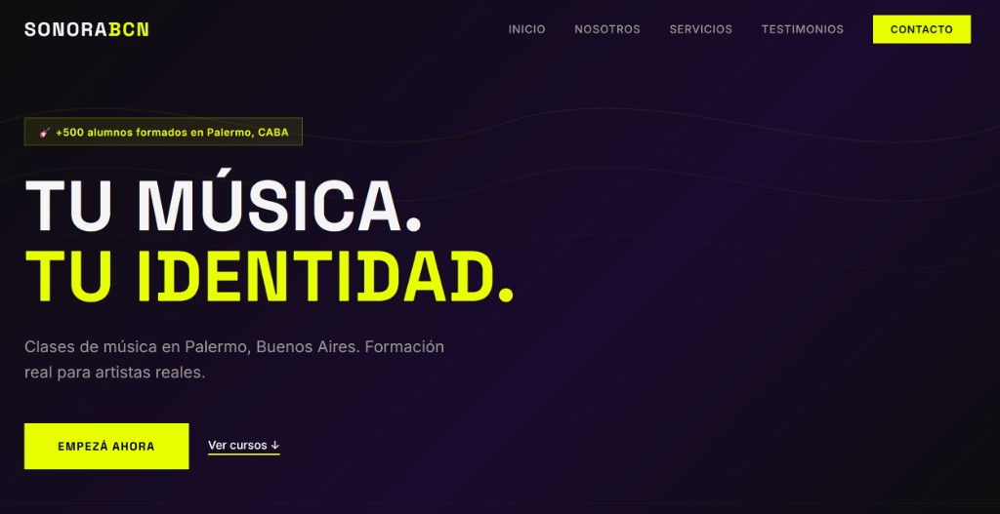 | 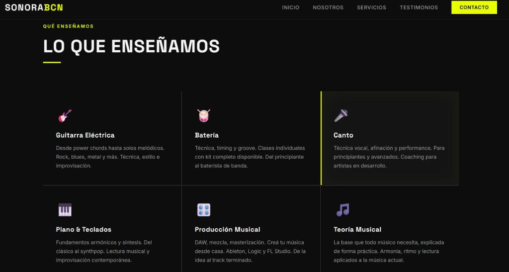 |

| Servicios | Testimonios |
|---|---|
| 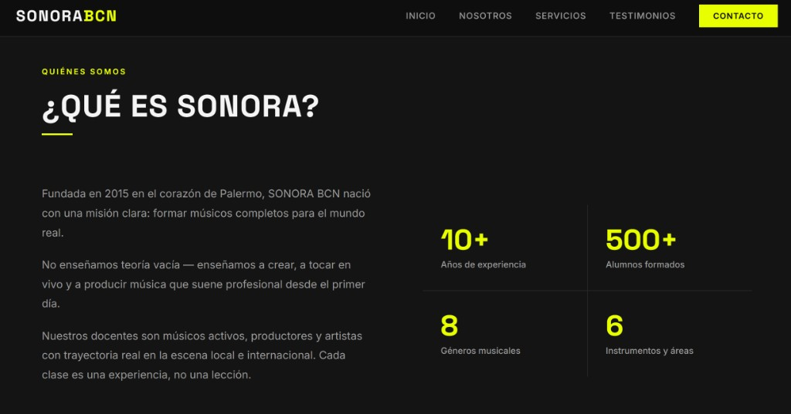 | 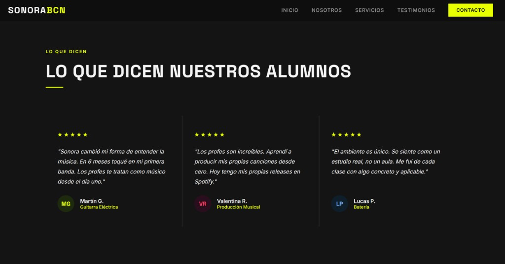 |

| Contacto | Footer |
|---|---|
| 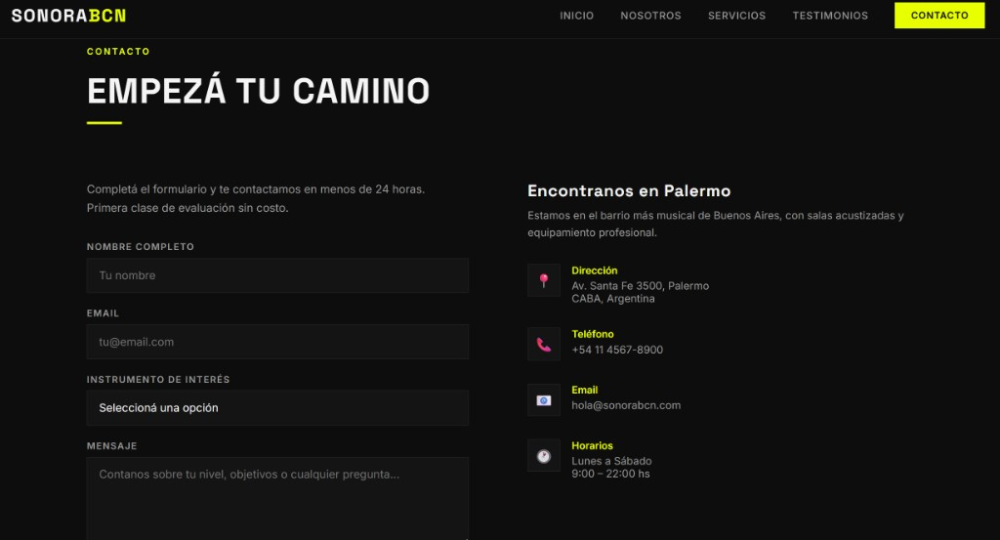 | 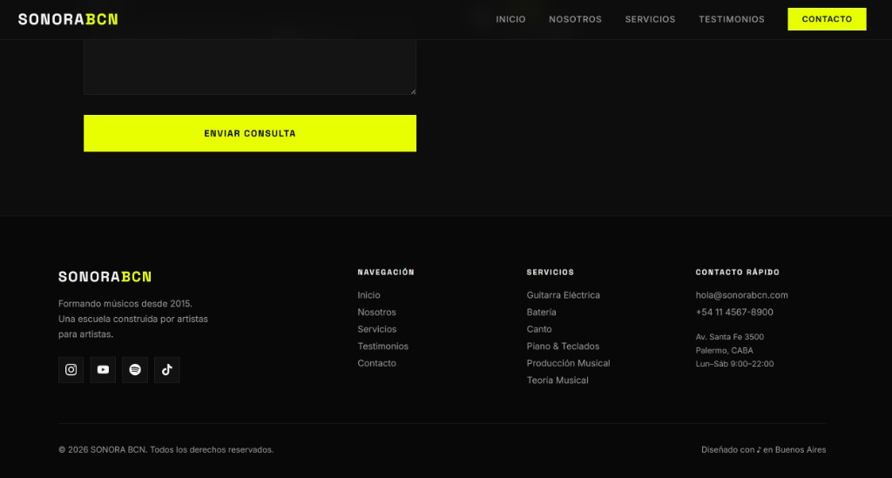 |

### Agente 2 — Cursor Agent (GPT-5.5)

| Hero | Sobre Nosotros |
|---|---|
| 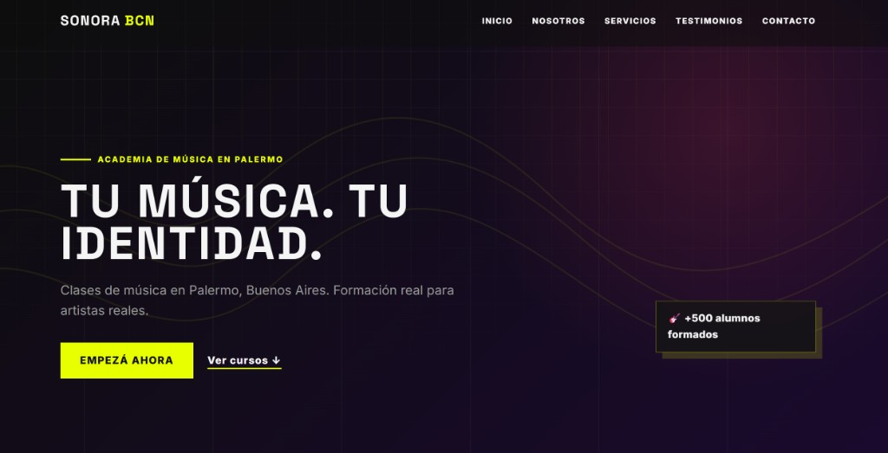 | 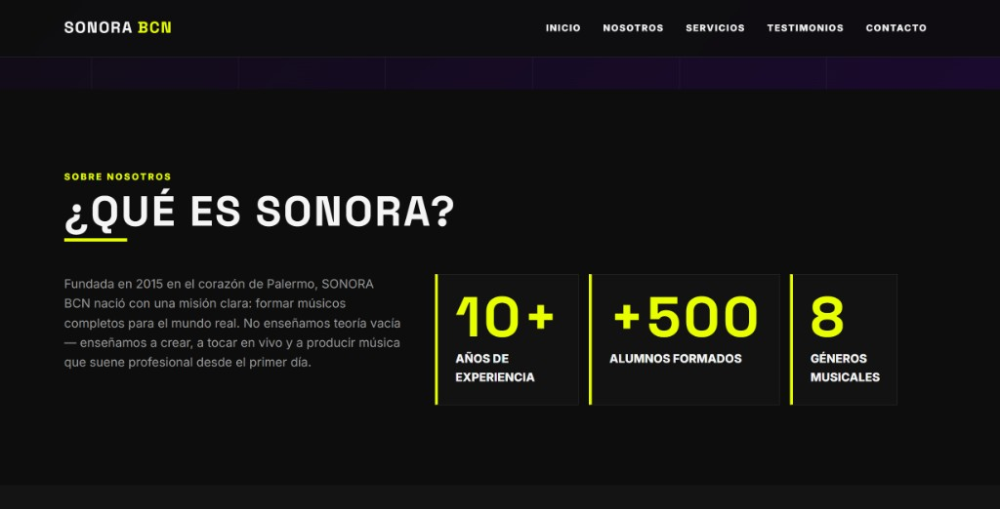 |

| Servicios | Testimonios |
|---|---|
| 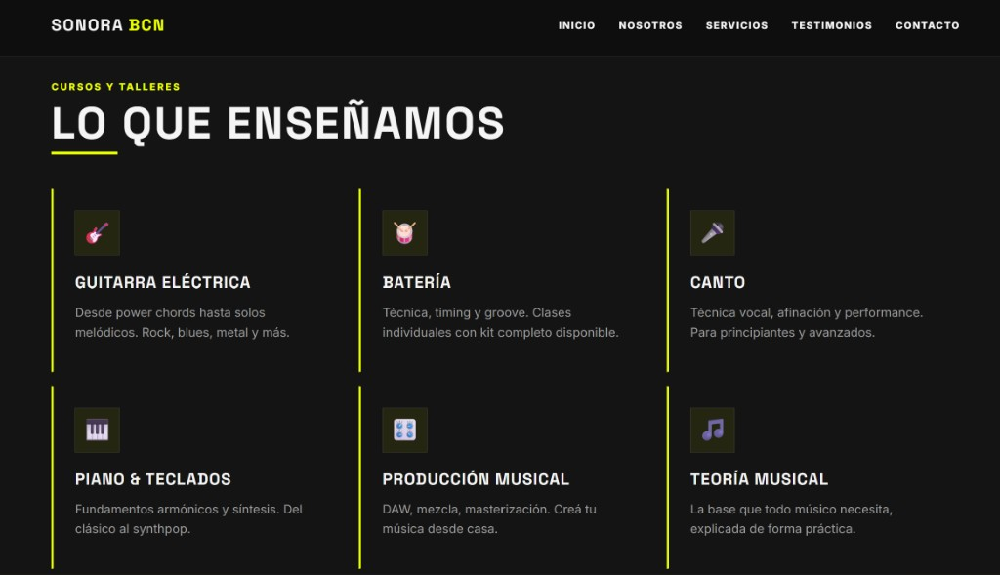 | 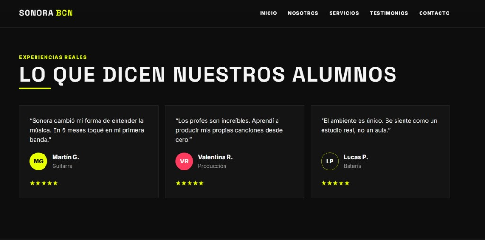 |

| Contacto | Footer |
|---|---|
| 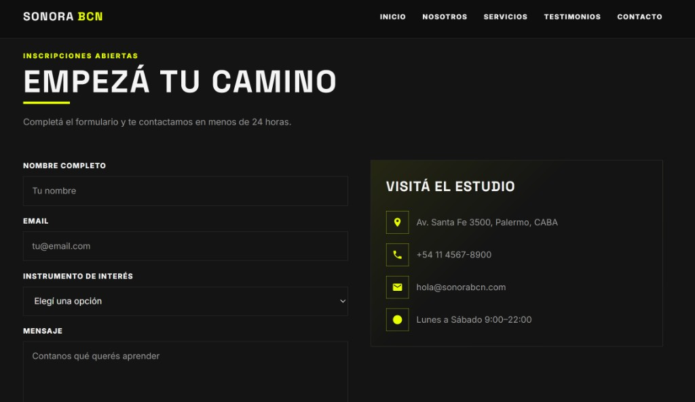 | 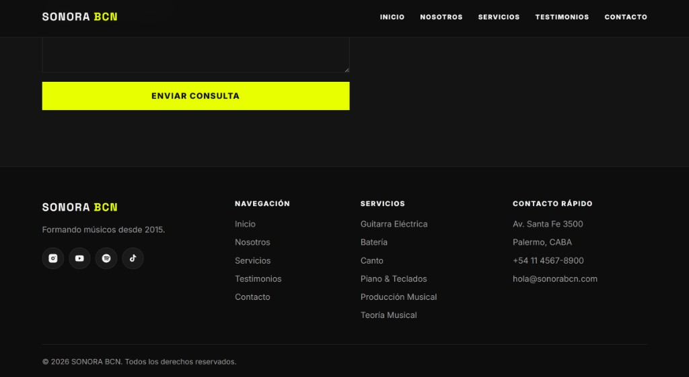 |

---

## 📚 Referencias

- [Anthropic Prompt Engineering Guide](https://docs.anthropic.com/en/docs/build-with-claude/prompt-engineering/overview)
- [OpenAI Prompt Engineering Guide](https://platform.openai.com/docs/guides/prompt-engineering)
